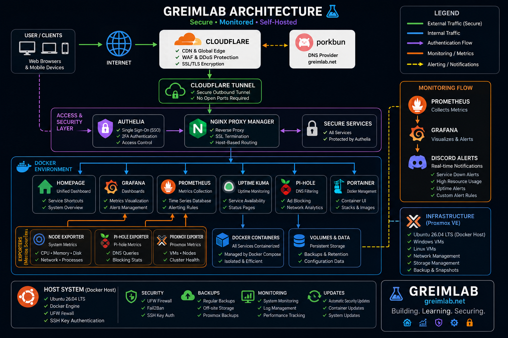
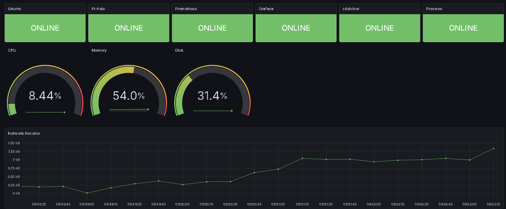

# 🖥️ GreimLab


Enterprise-style homelab focused on monitoring, automation, authentication, and self-hosted infrastructure.

---

## 📖 Overview

GreimLab is a self-hosted infrastructure environment running on Ubuntu Server that demonstrates enterprise technologies commonly found in production environments. The lab is designed to strengthen skills in systems administration, networking, monitoring, security, and automation while serving as a portfolio project.

---

## 🚀 Features

- 🌐 Cloudflare Tunnel Remote Access
- 🔒 HTTPS with Cloudflare
- 🔐 Single Sign-On (Authelia)
- 📊 Grafana Monitoring Dashboard
- 📈 Prometheus Metrics Collection
- 🚨 Discord Alerting
- 🖥️ Proxmox Monitoring
- 🛡️ Pi-hole DNS Filtering
- ❤️ Uptime Kuma Service Monitoring
- 🏠 Homepage Dashboard
- 🐳 Docker Compose Deployment

---

## 🏗️ Architecture




---

## 📊 Monitoring Dashboard



---

# 🛠️ Technology Stack

| Category | Technologies |
|-----------|--------------|
| Operating System | Ubuntu Server 26.04 LTS |
| Virtualization | Proxmox VE |
| Containers | Docker, Docker Compose |
| Reverse Proxy | Nginx Proxy Manager |
| Authentication | Authelia |
| Monitoring | Grafana, Prometheus |
| Metrics | Node Exporter, Pi-hole Exporter, Proxmox Exporter |
| DNS | Pi-hole |
| Status Monitoring | Uptime Kuma |
| Remote Access | Cloudflare Tunnel |
| Notifications | Discord |

---

# 📂 Repository Structure

```
greimlab/
├── alerts/
├── assets/
│   ├── diagrams/
│   └── screenshots/
├── dashboards/
├── docker/
├── docs/
├── monitoring/
└── scripts/
```

---

# 📚 Documentation

| Phase | Description |
|--------|-------------|
| Phase 1 | Ubuntu Server Installation |
| Phase 2 | Docker & Docker Compose |
| Phase 3 | Cloudflare Tunnel |
| Phase 4 | Nginx Proxy Manager |
| Phase 5 | Authelia |
| Phase 6 | Homepage |
| Phase 7 | Uptime Kuma |
| Phase 8 | Prometheus |
| Phase 9 | Grafana |
| Phase 10 | Pi-hole |
| Phase 11 | Proxmox Monitoring |
| Phase 12 | Operations Dashboard |
| Phase 13 | Discord Alerting |

---

# 🎯 Current Capabilities

✅ Secure Remote Access

✅ HTTPS Everywhere

✅ Single Sign-On Authentication

✅ Infrastructure Monitoring

✅ Real-Time Alerting

✅ DNS Filtering

✅ Service Availability Monitoring

✅ Virtual Machine Monitoring

---

# 📈 Future Improvements

- Infrastructure as Code (Ansible)
- Automated Backups
- Grafana Loki
- Promtail
- SSL Certificate Monitoring
- Docker Container Monitoring
- GitHub Actions
- Automated Deployments

---

# 👨‍💻 Author

**Aidan Greim**

Cybersecurity graduate with a passion for systems administration, infrastructure, networking, and security.

LinkedIn: https://www.linkedin.com/in/aidangreim/

GitHub: https://github.com/aidangreim17-png

---

# 📄 License

This project is licensed under the MIT License.
